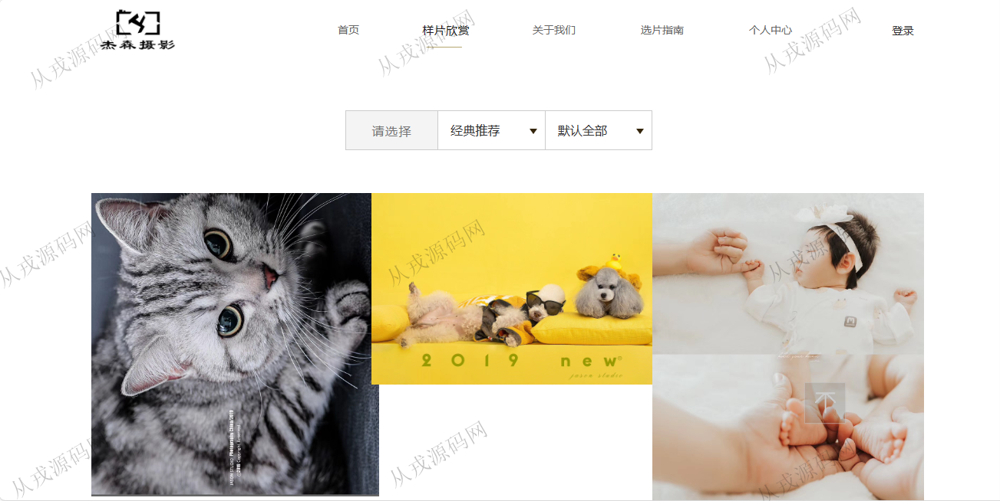

<h1 align="center">188.摄影管理系统</h1>

 获取sql文件 QQ: 386869957 QQ群: 377586148 

 [更多源码项目: 从戎源码网](https://armycodes.com/) 

## 简介

> 本代码来源于网络,仅供学习参考使用!
>
> 提供1.远程部署/2.修改代码/3.设计文档指导/4.框架代码讲解等服务
> 
> 首页  http://localhost:8080/photoStudio/pc/index
> 
> 后台  http://localhost:8080/photoStudio/login/toIndex
> 
> 前台用户： 用户名：123401 密码：123456
> 
> 后台用户： 有权限的用户： 用户名：admin 密码：123456 没有权限的用户： 用户名：admin1 密码：123456
> 

## 项目介绍
基于ssm的摄影管理系统：前端 jsp、jquery、layui，后端 springmvc、spring、mybatis；角色分为管理员、用户；集成样片欣赏、选片指南、在线预约等功能于一体的系统。

## 功能介绍

### 用户

- 基本功能：登录，注册，退出，密码修改
- 网站首页：主导航栏，轮播图，宠物样片，儿童样片，个人样片，婚礼跟拍样片欣赏
- 样片欣赏：分类导航，收藏，在线预约
- 选片指南：指南信息展示，详情介绍
- 个人中心：个人资料查看与修改，我的收藏列表，我的意向列表，我的预约，我的订单

### 管理员

- 客户管理：客户由前台自行注册而来，管理员也可以进行增删改查操作
- 收藏管理：查看客户收藏的列表信息
- 评论管理：查看客户评论信息，删除操作
- 类别管理：类别信息的增删改查
- 样片管理：样片信息的增删改查，图片上传，变更为新增，变更为可出售
- 图片管理：图片信息的增删改查
- 轮播图管理：轮播图信息的增删改查，对应前台轮播图展示
- 意向样片管理：样片信息的列表查询
- 预约管理：客户预约信息的查看，搜索，删除操作
- 订单管理：订单信息的查看与删除
- 统计分析：样片收藏率分析，订单率分析（柱状图展示）

## 环境

- <b>IntelliJ IDEA 2021.3</b>

- <b>Mysql 5.7.26</b>

- <b>Tomcat 7.0.73</b>

- <b>JDK 1.8</b>

## 运行截图

